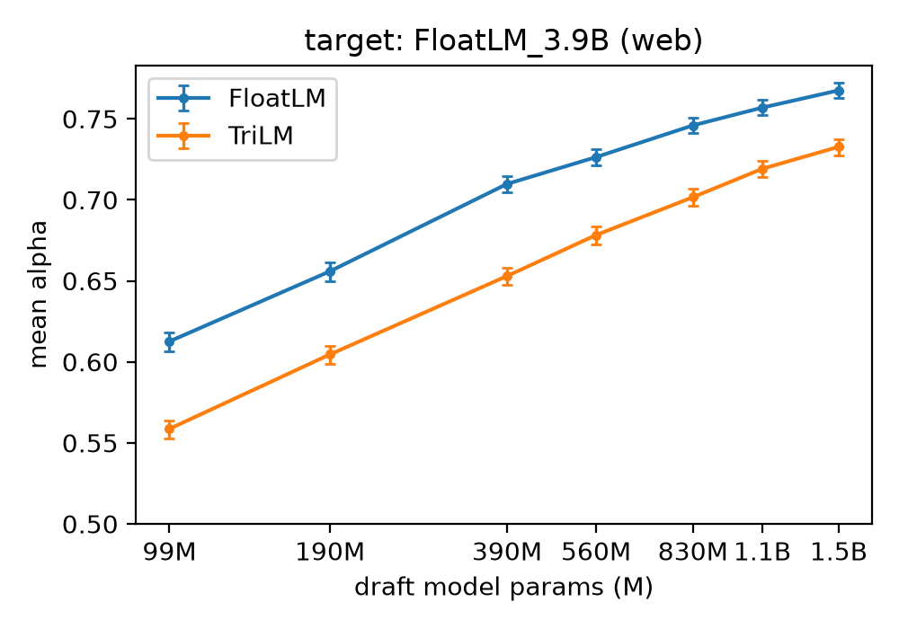
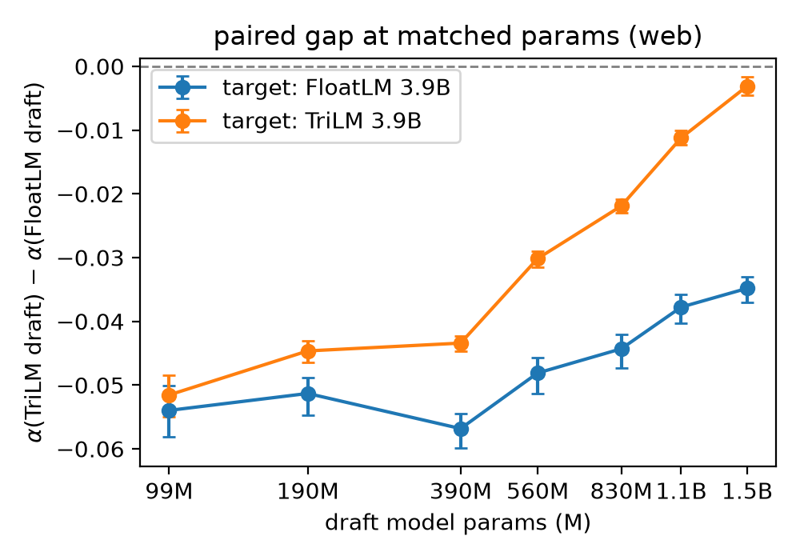
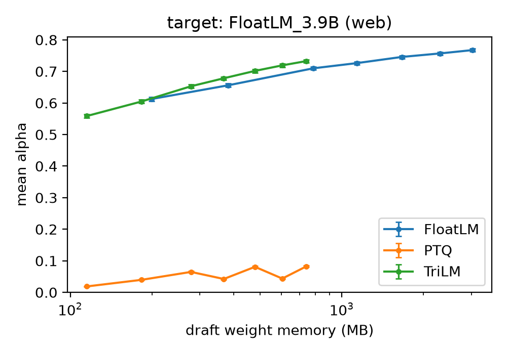
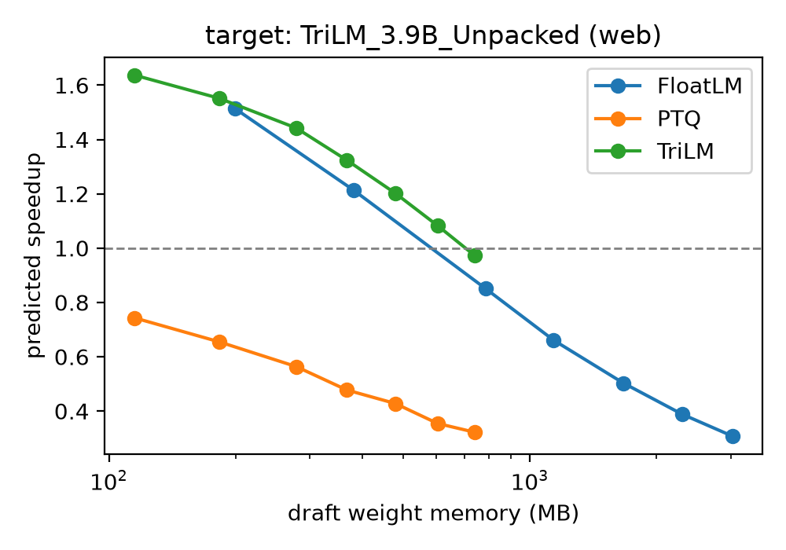
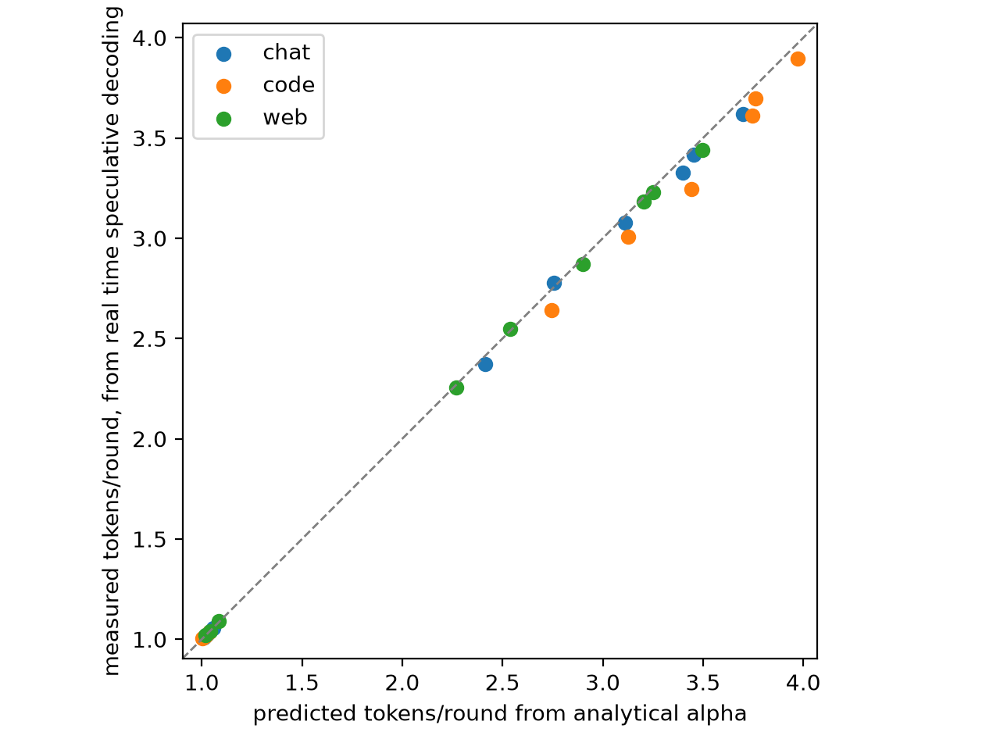

# Should Your Draft Model be Ternary?
# Abstract
Speculative decoding speeds up LLM inference, and in memory-bound devices, the speedup is dependent on the draft model’s memory footprint. Using ternary models, which are smaller in memory footprint, remains untested because comparing FP16 and ternary QAT models requires training both models identically apart from precision. We use the SpectraSuite to measure and compare the acceptance rate of 21 draft models spanning FP16, ternary-via-QAT, and ternary-via-PTQ against two 3.9B targets across 3 domains. We validate the analysis against end-to-end speculative decoding with k=5. We find that an FP16 draft needs 1.74x as much memory to match the best ternary draft's acceptance rate. We also find that against a ternary target, the acceptance rate penalty of using a ternary draft nearly vanishes (-0.0031), while against a FP16 target it stays substantial (-0.0348). At a matched memory footprint, despite having identical architecture, parameter count, and memory footprint, PTQ performs worse with acceptance rate at 0.0823 compared to the QAT ternary model’s 0.7327. This degradation makes speculative decoding with PTQ slower (0.74x) compared to not using speculative decoding.

# Introduction
LLM inference is expensive and slow, especially in consumer devices. A technique called “Speculative Decoding” enables faster inference for no output quality loss, using the elegant technique of having a smaller “draft” model constantly generate k sequential predictions cheaply and the main model, the “target”, scoring those predictions in one forward pass, instead of k passes. This means, in the best scenario where the draft model generates excellent tokens, the target model “generates” k+1 tokens in one forward pass, instead of generating only one token. 

Especially in consumer devices, which are usually memory-bandwidth-bound, the speedup is limited by draft models’ footprint in memory. The field has techniques for making models take up less space in memory for a small quality loss. We decided to test one of those techniques, called Quantization-Aware Training (QAT) with ternary weights, to see if it actually speeds up speculative decoding.

To our knowledge, no controlled comparison like this exists, since comparing ternary models and higher-precision models such as FP16 models requires the models to have identical architecture, tokenizer, and training sets. This was made possible by SpectraSuite, in which researchers released pretrained models both in FP16 and ternary, identical in almost every way, paving the way for comparison.

We took SpectraSuite’s FP16 and ternary models, and tested their speculative decoding capabilities, both analytically and empirically. We also tried a technique called Post-Training Quantization (PTQ) on the FP16 models to see whether the speedups come from the models being ternary themselves, or from the way models were trained.

We found that the ternary models performed better in comparison to the FP16 models at equal or smaller memory footprint across the entire tested range. We also found out that against a ternary target, the cost of using a ternary draft nearly vanishes, while against a FP16 target it stays substantial. Lastly, we found that PTQ absolutely collapses the model, and causes speculative decoding to be actually slower.

# Setup
We evaluate the models of the SpectraSuite family. The chosen models range from 99M to 3.9B parameters. We use models from two sub-families: FloatLM, which is trained with FP16 precision, and TriLM, which is trained with Quantization-Aware Training (QAT) at ternary precision. All the models have been trained on the same 300B tokens, have the same LLaMA-style architecture and share the same tokenizer [Kaushal et al., 2024].

We use draft and target models from both precisions: half-precision (FP16) and ternary draft models from 99M to 1.5B, and FP16 and ternary target models at 3.9B. We evaluate 14 pretrained draft models plus 7 PTQ variants against 2 target models.

We create our own Post-Training Quantization (PTQ) models by applying per-matrix absmean round-to-nearest (RTN) on SpectraSuite's FP16 models. Absmean RTN is the technique used by SpectraSuite while training the TriLM family with QAT, so the PTQ application serves as a control. We conduct this operation only on the seven block projections: the query/key/value/output projections in attention, and gate/up/down MLP projections. We leave the embeddings, norms, and the output LM head untouched.

We evaluate speculative decoding acceptance rate across 3 domains and 1,024 prompts: the web domain with a size of 512 prompts, the code domain with a size of 256 prompts, and the chat domain with a size of 256 prompts. The web dataset comes from allenai/c4, which itself comes from Common Crawl. The code dataset is a subset of HuggingFaceCode/stack-v3-train, which comes from public GitHub repositories. Only repositories with permissive licenses were used. The chat dataset comes from allenai/WildChat-4.8M, which consists of conversations between users and ChatGPT.

Documents are sampled from each dataset using a fixed seed. We start the prompt prefixes at token index 500 of every chosen dataset document. The prompts are all 256 tokens long, and we make the target models generate tokens 256-511. During generation and scoring, we mask the EOS token at every position by setting its pre-softmax logit to $-\infty$, so the target model generates tokens and the draft model computes logits until position 511. We use temperature $1.0$. In total, 21 draft models, 2 target models, and 3 domains give us 126 target-draft-domain combinations.

We define $\alpha_t$, the acceptance probability at token position $t$, as
$$ \alpha_t = \sum_{x \in V} \min\big(p_t(x),\, q_t(x)\big)$$ 
where $V$ is the models’ vocabulary, $x$ is a token in $V$, $p_t(x)$ is the probability assigned to token $x$ by the target model at position $t$, and $q_t(x)$ is the probability assigned to token $x$ by the draft model at position $t$. 

At position $t$, $p_t$ and $q_t$ are conditioned on the 256-token prefix plus the target-generated continuation up to position $t-1$. This makes the computation of $\alpha$ teacher-forced. We compute the mean acceptance probability per prompt $\alpha_{\text{prompt}}$ by averaging $\alpha_t$ over the 256 positions that the target generated. 

We define analytical $\alpha$ as $\alpha_{\text{prompt}}$ averaged over all the prompts that a specific combination was evaluated on. $\alpha$ is used interchangeably with acceptance rate, since $\alpha_t$ equals the probability that a token sampled from $q_t$ is accepted by the speculative sampling rejection rule. This identity was derived in the original speculative decoding paper [Leviathan et al., 2023].

We model the expected tokens per round as $\mathbb{E}[\text{tokens/round}] = \sum_{i=0}^{k} \alpha^i = \frac{1 - \alpha^{k+1}}{1 - \alpha}$, where a round is one cycle of draft proposing and target verifying, and $k$ is the number of tokens drafted per round. We assume that each drafted token is accepted independently with probability $\alpha$ [Leviathan et al., 2023]. In Section X, for validation, we evaluate this formula per prompt at $\alpha_{\text{prompt}}$ and average the per-prompt predictions. In Section Y, for speedup, we evaluate this formula per combination at the analytical $\alpha$ of that combination. By convexity, the latter understates the average of per-prompt predictions, making the speedup estimates conservative.

We estimate 95% confidence intervals (CIs) of analytical $\alpha$ with a nonparametric bootstrap via resampling of $\alpha_{\text{prompt}}$ with replacement (percentile method, 2,000 resamples). We also pair up the FP16 and ternary draft models by their parameter counts and evaluate the penalty of using a ternary draft model, the analytical $\alpha$ difference $\alpha(\text{TriLM draft}) - \alpha(\text{FloatLM draft})$, for each pair. We use the same CI estimation but with per-prompt differences.

For TriLM and PTQ models, only the seven block projections use ternary weights and we assume they occupy 2 bits per weight [Vaidhya et al., 2025]. We assume the other weights of these models and all of the weights of FloatLM models occupy 16 bits per weight.

Speedup is computed relative to the standard autoregressive, target-only decoding ($1\times$). We measure everything using one target-forward-pass cost as a unit. We assume the cost is memory-bound, so $\text{cost of one forward pass of a model} \approx \text{cost of streaming the model’s weights}$. Therefore we derive cost $c$ as $\frac{\text{memory footprint of the draft model}}{\text{memory footprint of the target model}}$. Scoring $k$ tokens (and obtaining the bonus/resample distribution) costs $1$, since it only takes one target forward pass. Using the above definitions, we calculate speedup using the formula
$$\frac{\mathbb{E}[\text{tokens/round}]}{1 + k \cdot c}$$
where $1$ is the cost of the target’s forward pass, $k$ is the number of tokens drafted per round, and $c$ is the relative cost of a single draft forward pass. We use $k=5$ throughout this paper.

We also validate the analytical part of this experiment with end-to-end speculative decoding runs. We randomly select a total of 256 prompts from our datasets (128 web prompts, 64 code prompts, 64 chat prompts). We run real-time speculative decoding using 9 draft models {99M, 560M, 1.5B} $\times$ {FloatLM, TriLM, PTQ} on each prompt, where we measure accepted draft tokens (plus the bonus/resample token) per round. We use a FloatLM_3.9B target in validation.

# Results

## The claim
When evaluating mean analytical $\alpha$ against a fixed parameter count, ternary models perform worse in every parameter size tested. However, we claim that in draft model selection, draft models can also be judged by draft models’ memory footprint rather than only parameter counts.

When we evaluate the draft models’ analytical $\alpha$ against the models’ memory footprint, the ternary models perform better in comparison to the FP16 models at equal or smaller memory footprint, across the entire tested range. 

As an example, TriLM_1.5B occupies 740 MB and reaches $\alpha = 0.733$, where a FP16 draft needs 1289 MB to match it, which is 1.74× as much memory. The advantage grows with scale, from 1.31× at 278 MB (ternary size).

As another example where the memory footprint is held similar, TriLM_1.5B (740MB) is smaller than FloatLM_390M (785MB), and its $\alpha$ is $0.0229$ higher than FloatLM_390M ($0.7327$ vs $0.7098$). Results are consistent across chat and code (Appendix Table N).

Figure 1, side by side:

Figure 1: Mean acceptance rate a against draft parameter count (left) and draft memory footprint (right), web domain, FloatLM_3.9B target.

## Precision Matching
There is a penalty we pay when using ternary drafts compared to their FP16 counterparts at matched parameters, and we calculate it as $\alpha(\text{TriLM draft}) - \alpha(\text{FloatLM draft})$.

However, this penalty depends on the precision of the target model we use. At small parameter counts, the penalty is similarly large against both FP16 and ternary target models. For example, at 99M, the penalties are $-0.0540$ and $-0.0515$, respectively. As the parameter count increases, the penalty against the ternary target rapidly narrows toward zero whereas the penalty against the FP16 target narrows much more slowly. At 1.5B, the penalty against the ternary target stands at $-0.0031$, whereas the penalty against the FP16 target stands at $-0.0348$. There is a visible difference between penalties against FP16 targets and ternary targets, depending on model parameter count.

This suggests two components of the penalty: inferior model capacity and precision mismatch between the target and the draft models. At small parameter counts, the penalty is similarly large against both FP16 and ternary targets. This suggests that the penalty at small parameter counts doesn't depend on target model’s precision. At larger parameter counts, the differences in penalty become larger. At 1.5B, the difference between penalties against FP16 and ternary targets rises to $0.0317$, from $0.0025$ at 99M.

Switching the target from FP16 to ternary makes the FP16 draft worse (−0.0123) and the ternary draft better (+0.0194). Results are consistent across chat and code (Appendix Table N).

| draft (1.5B) | FloatLM_3.9B target | TriLM_3.9B target | Δ going from FP to ternary target |
|---|---|---|---|
| FloatLM_1.5B | 0.7675 | 0.7552 | −0.0123 |
| TriLM_1.5B | 0.7327 | 0.7521 | +0.0194 |
| Δ going from FP to ternary draft  | −0.0348 | −0.0031 | |

Figure 2:

Figure 2: The difference between mean acceptance rates of ternary and FP16 draft (the analytical $\alpha$ gap) against draft parameter count, web domain, against both FloatLM_3.9B and TriLM_3.9B targets.

## PTQ
Holding memory footprint fixed, the method of quantization matters. Ternary drafts trained with QAT work, while the ternary drafts quantized via PTQ collapse. In Figure 3, it is visible that PTQ completely collapses the model quality and analytical alpha.

At a memory footprint of ~740 MB, TriLM_1.5B and PTQ_1.5B have identical architecture, parameter counts, and memory footprint. However, the PTQ performs significantly worse with analytical $\alpha$ at $0.0823$ compared to the QAT ternary model’s $0.7327$. Results are consistent across chat and code (Appendix Table N).

Figure 3: Mean acceptance rate a against draft memory footprint, web domain, PTQ included, FloatLM_3.9B target.

## Speedup
Ternary drafts’ speedup peaks at 2.28x, compared to FP16 drafts’ peak of 2.17x.

Ternary drafts’ speedup sits at 2.05–2.28x across the full 115–740 MB range, while FP16 peaks at 2.17× with a 99M draft and falls to 1.18× by 1.5B. FP drafts’ speedup is strongly dependent on model parameter count, while ternary drafts’ speedup isn't.

We also anticipate that the speedup of ternary draft will increase as the target model gets larger, since $c$ will decrease significantly.

The speedups of all draft models against the ternary target is lower when compared to the speedups against the FP target. This is caused by the target model’s footprint already being small, resulting in a higher c in the speedup formula.

PTQ slows generation down. PTQ_1.5B at 740 MB generates 1.09 tokens per round, which amounts to a 0.74x speedup, slower than not using speculative decoding at all. Results are consistent across chat and code (Appendix Table N).

Figure 4: Predicted speedup against draft memory footprint, web domain, PTQ included, FloatLM_3.9B target.

Figure 5: Predicted speedup against draft memory footprint, web domain, PTQ included, TriLM_3.9B target.

## Validation
Predicted and measured tokens per round track each other closely across 27 distinct combinations of domains and draft models. Mean deviation is -0.0394 on values from 1.01 to 3.97, with a maximum of 0.19. Measured values fall below predicted in 21 of the 27 combinations. One likely cause is that acceptance declines across draft depth, whereas the analytical estimate sees target-generated context at every position. Results are consistent across chat and code (Appendix Table N).

Figure 6: Measured tokens per round from real time speculative decoding against predicted tokens per round computed from the analytical alpha, all domains, PTQ included, FloatLM_3.9B target.

# Related Work
Speculative decoding has been proposed to speed up inference by using a smaller model to autoregressively generate k tokens in k passes, and making the main model score these k tokens plus its own prediction in one forward pass, with a rejection rule that preserves the target's output distribution [Leviathan et al., 2023, Chen et al., 2023]. BitNet explored 1-bit transformers with weights {-1, 1}, and BitNet b1.58 proposed transformers with ternary weights {-1, 0, 1} [Wang et al., 2023, Ma et al., 2024]. Spectra explores training ternary models on a much larger scale, and comparing them to the identical-except-precision FP16 counterparts [Kaushal et al., 2024]. Spectra 1.1 proposes a 2-bit packing scheme for storing weights [Vaidhya et al., 2025].

Measuring acceptance rate across multiple domains was explored by Mahmoud [Mahmoud, 2026]. Applying post-training quantization to parts of speculative decoding has been explored by QSpec, which uses a quantized version of the target as the draft model with the models sharing weights, drafting at 4-bit weights and activations, and scoring at 4-bit weights with 16-bit activations [Zhao et al., 2024]. Similarly, QuantSpec uses 4-bit weights and a 4-bit KV cache for long-context inference [Tiwari et al., 2025]. In contrast, ML-SpecQD uses separate MXFP4-quantized drafts, and the authors propose exploring 2-bit drafts as future work [Georganas et al., 2025]. 

These works mainly focus on quantization after training. Whether a model trained at low precision with QAT makes a better draft has not been tested, because it requires a low-precision and a full/half-precision model matched in architecture, tokenizer, and training data. This pair did not exist publicly until the Spectra suite.

# Limitations
Some limitations of this study include:
1. PTQ: The PTQ method used is native absmean RTN, which is the same quantization function TriLM uses during QAT. This makes it the right control for isolating training-time vs post-training quantization under the same weight format. However, this method is fairly primitive. Stronger methods with calibration or error compensation (e.g., GPTQ, AWQ) would likely collapse far less. So our results show that naive RTN ternarization fails at these scales, and that QAT avoids this failure. They do not show that there is no post-training path to a ternary draft.
3. Scope: Although two different targets were used, only one target size was used (3.9B), k was fixed at k=5, EOS was masked to prevent early termination, and a fixed prefix was used.
4. Lack of wall-clock speedup measurements: SpectraSuite’s pre-released ternary models were unpacked, which means that although the weights are ternary, they are stored in FP16 format on disk. Speedups are predicted from the cost model rather than measured real time. The cost is only computed from memory footprint, assuming that speedup is memory-bound.
5. Domain: We only test 3 domains, and we test continuation from a fixed offset. Since SpectraSuite models were only pretrained, our prompts do not include instruction following or reasoning tasks. 
6. Validation: The empirical validation only runs on 9 selected models on a subset of the prompt set, consisting of 256 prompts.

# Conclusion & Future Work
We find that an FP16 draft needs 1.74x as much memory to match the best ternary draft's acceptance rate. The difference in acceptance rate against FP and ternary drafts, implies two components: inferior model capacity and precision mismatch between the target and the draft models. In regard to QAT vs PTQ, the reason why ternary models perform better when we hold memory footprint fixed is QAT, not the quantization itself. Also, FP drafts' speedup is strongly dependent on model parameter count, while ternary drafts' speedup isn't.

On memory-bound hardware, ternary draft models should be chosen rather than FP16 draft models for higher acceptance rates and speedup.

Future work includes real-time wall-clock speedup measurements, and testing drafts with larger ternary targets. This would require ternary models to be more common. It is a promising direction specifically because our own data shows that the ternary penalty vanishes as the ternary draft size increases against a ternary target.

# Appendix