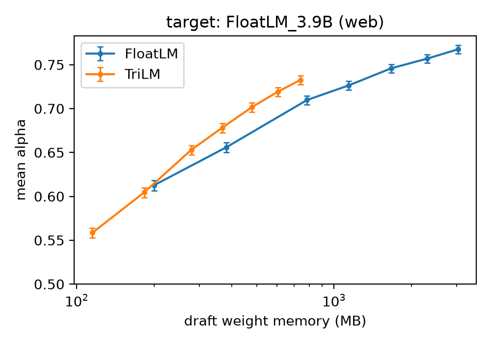
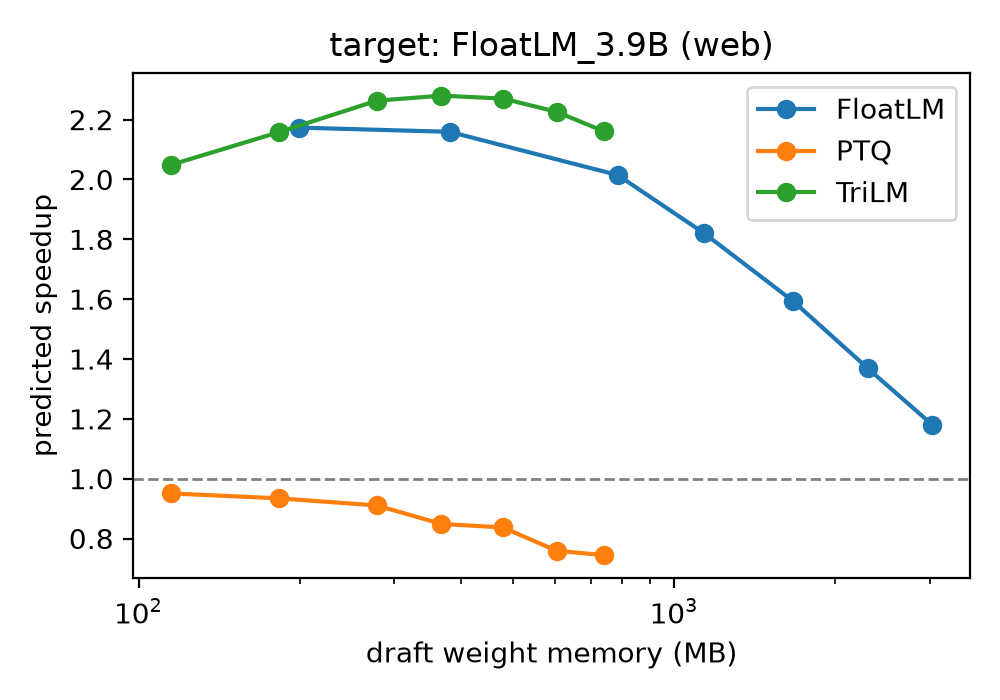

# Speculative Decoding with Ternary Drafts
This experiment explores the viability of using ternary models as draft models against FP16 and ternary target models. I tested the models of [SpectraSuite](https://huggingface.co/SpectraSuite) to see the memory footprint and acceptance rate ($\alpha$) difference and calculate a theoretical speedup ratio. I also validated the analysis with an actual end-to-end speculative decoding pipeline. Ternary models did much better than I expected.

# I **strongly** recommend looking at the [paper](https://erenmenges.com/writings/papers/preprint_should_draft_be_ternary.pdf) instead of reading the results and setup from this page. I submitted this to a NeurIPS 2026 workshop and it is under review as of now.


## How Ternary Works
I strongly recommend you read [the article I wrote on this](https://erenmenges.com/how-ternary-works) (without AI!). I had a very hard time trying to understand how ternary works, and there was no simple guide/math explainer for it. So I wrote one.

## Results
### Main result - ternary typically outperforms FP16 at matched memory
At matched parameter count, ternary drafts attain lower $\alpha$ at every size tested. On memory-bound hardware, however, a draft’s cost is set by its memory footprint, not its parameter count. Evaluated at matched memory footprint, ternary drafts achieve higher $\alpha$ at every point on the 200–740 MB overlap, except the 200 MB boundary (tie) (Figure 1). The advantage widens with scale: an FP16 draft requires $1.31\times$ the memory to match a 278 MB ternary draft, rising to $1.74\times$ at 740 MB (1.5B parameters).

Figure 1:


### Does ternary have a penalty? Does it depend on the target model’s precision?
Ternary drafts incur an $\alpha$ penalty relative to their FP16 counterparts at matched parameters. I calculate it as $\alpha\texttt{(TriLM draft)}−\alpha(\texttt{FloatLM draft})$. However, this penalty depends on the precision of the target model. For example, at 99M, the penalties against the FP16 and ternary targets are $−0.0540$ and $−0.0515$, respectively. As the parameter count increases, the penalty against the ternary target rapidly narrows toward zero whereas the penalty against the FP16 target narrows much more slowly (Appendix Figure 3). This suggests two components of the penalty: reduced draft capacity and precision mismatch between the target and the draft models (Appendix Tables 2, 4, and 5).

### Speedup
The speedup of ternary drafts remains within $2.05$-$2.28\times$ across the full 115–740 MB range, while FP16 peaks at $2.17\times$ with a 99M draft and falls to $1.18\times$ by 1.5B (Figure 2). 

Figure 2:


### What about PTQ?
At fixed memory footprint, the quantization method matters. Ternary drafts trained with QAT retain high $\alpha$, while the ternary drafts quantized via PTQ collapse. PTQ slows generation. PTQ_1.5B at 740 MB generates $1.09$ tokens per round, which amounts to a $0.74\times$ speedup, slower than standard autoregressive decoding.

### Validation
Predicted and measured tokens per round track each other closely across 27 distinct combinations of domains and draft models. Mean deviation is $−0.0394$ on values from $1.01$ to $3.97$, with a maximum absolute deviation of $0.19$. 

# Installation
## Requirements
- Python 3.14
- PyTorch 2.13+
- 70GB disk space

## Setup
### uv
```bash
git clone https://github.com/erenmenges/speculative-decoding-ternary.git
cd speculative-decoding-ternary
uv sync
source .venv/bin/activate
```

### pip
```bash
git clone https://github.com/erenmenges/speculative-decoding-ternary.git
cd speculative-decoding-ternary
python3.14 -m venv .venv
source .venv/bin/activate
pip install -e .
```


# Running the Experiment
### Download the models and stream from the master datasets to prepare our datasets
```bash
python prepare.py
```
### Ternarize the FP models to create PTQ variants
```bash
python ternarize.py
```
### Generate the target logits 
```bash
python generate.py
```
### Score drafts on target logits
```bash
python score_alpha.py
```
### Validate analytical results with an end-to-end speculative decoding run
```bash
python spec_decode.py
```

### Analyze the results and generate figures
```bash
python analyze.py 2>&1 | tee data/results.txt
```